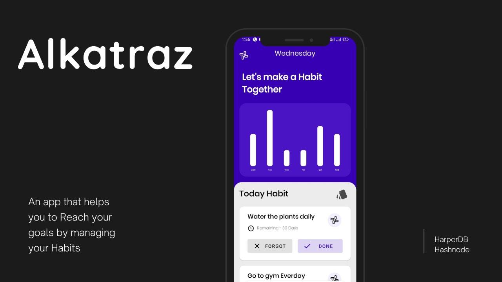
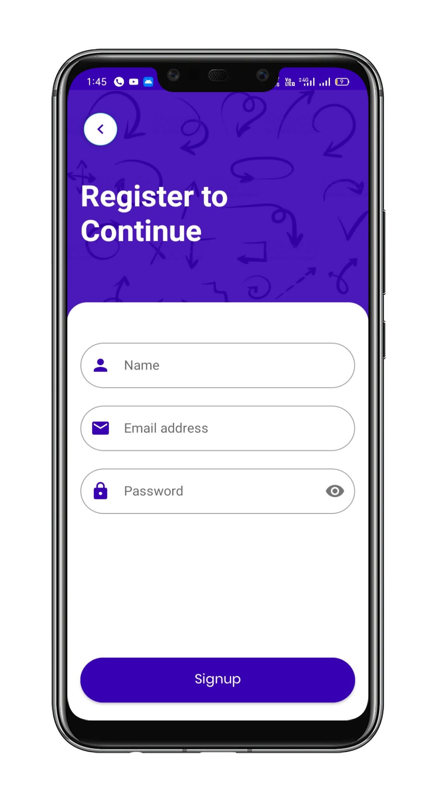
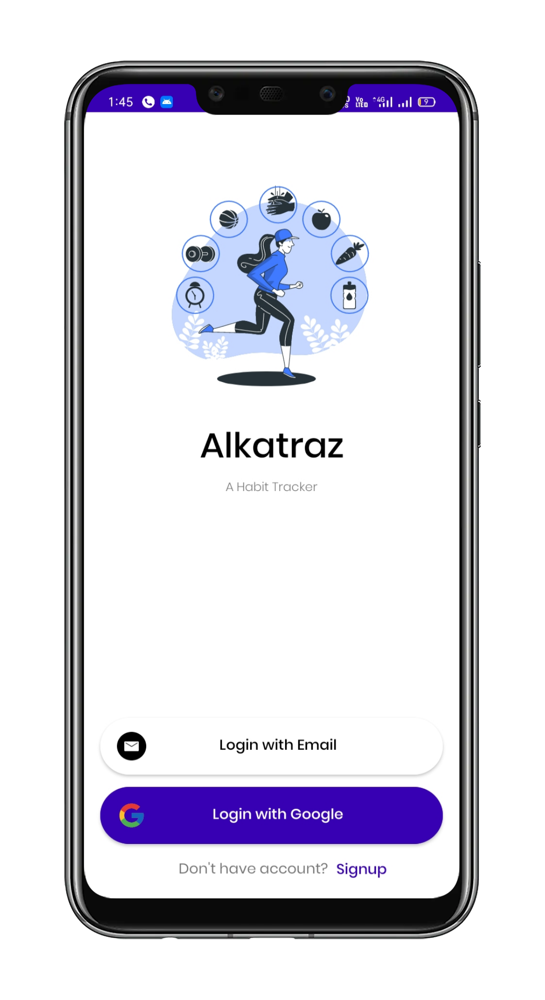
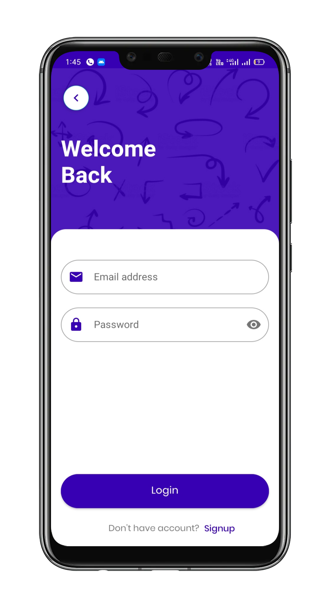
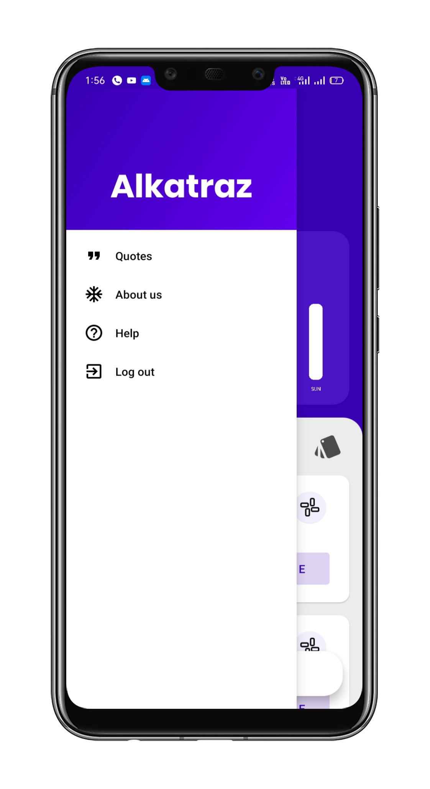
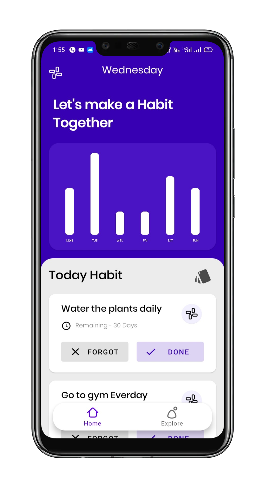
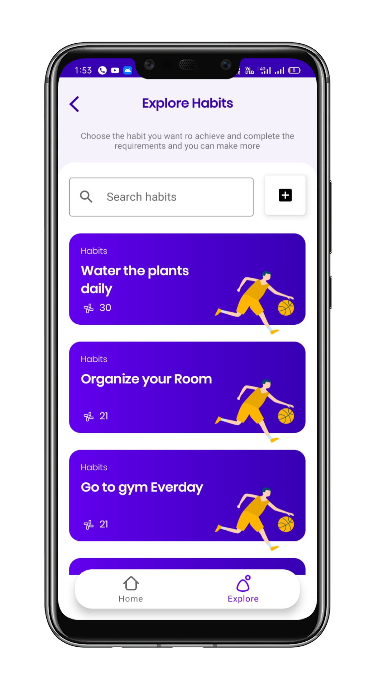
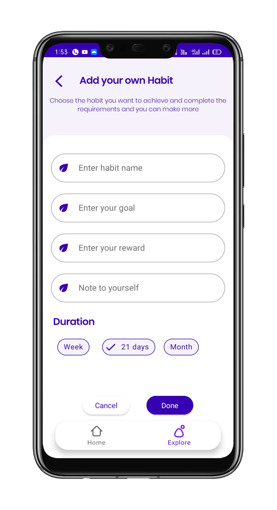
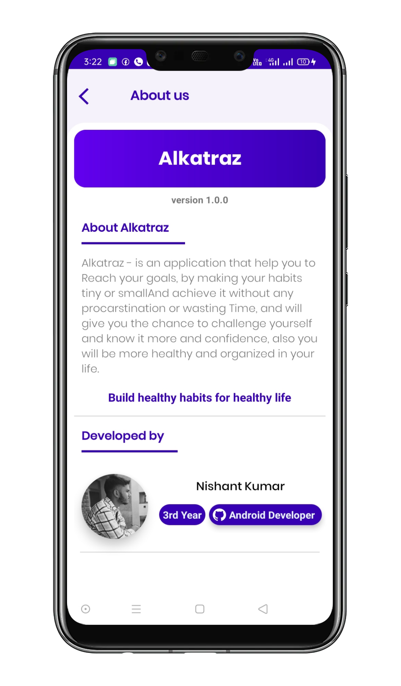
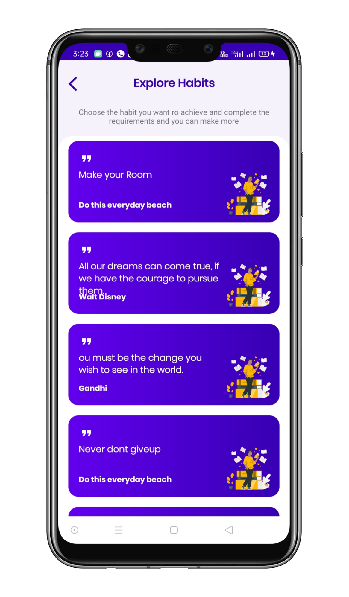

# **Alkatraz - Build healthy habits for healthy life** 

**Alkatraz** is an app that helps you to Reach your goals by managing your Habits . It's makes your life more organize, controllable, more enjoyable and makes you feel better with making healthy habits by makes the habits small or tiny to be more discipline, and feel guilty free by making small reward after every achievement even if the achievement is small.

## About

 It uses firebase and HarperDB as it's backend. It uses Firebase Authentication for email based auth and Google auth, Firebase Crashlytics for crash reporting and HarperDB as its database.

- Monitor your habits weekly
- Track your habits daily
- Remind you about your habits
- Choose from different pre-definded habits
- Create your custom habits
- Motivate your self with amazing quotes

## 📸 Screenshots

||||
|:----------------------------------------:|:-----------------------------------------:|:-----------------------------------------: |
||||
||||
||||

## Built With 🛠
- [Kotlin](https://kotlinlang.org/) - First class and official programming language for Android development.
- Clean Architecture
- [Coroutines](https://kotlinlang.org/docs/reference/coroutines-overview.html) - For asynchronous and more..
- [Android Architecture Components](https://developer.android.com/topic/libraries/architecture) - Collection of libraries that help you design robust, testable, and maintainable apps.
  - [ViewModel](https://developer.android.com/topic/libraries/architecture/viewmodel) - Stores UI-related data that isn't destroyed on UI changes. 
  - [ViewBinding](https://developer.android.com/topic/libraries/view-binding) - Generates a binding class for each XML layout file present in that module and allows you to more easily write code that interacts with views.
  - [DataBinding](https://developer.android.com/topic/libraries/data-binding) - Binds data directly into XML layouts
  - [Room](https://developer.android.com/training/data-storage/room) - Room is an android library which is an ORM which wraps android's native SQLite database
  - [DataStore](https://developer.android.com/topic/libraries/architecture/datastore) - Jetpack DataStore is a data storage solution that allows you to store key-value pairs or typed objects with protocol buffers.
- [Dependency Injection](https://developer.android.com/training/dependency-injection) - 
  - [Hilt-Dagger](https://dagger.dev/hilt/) - Standard library to incorporate Dagger dependency injection into an Android application.
  - [Hilt-ViewModel](https://developer.android.com/training/dependency-injection/hilt-jetpack) - DI for injecting `ViewModel`.
- Backend
  - [Firebase](https://firebase.google.com)
    - Firebase Auth - To support email based authentication and google authentication
    - Firebase Crashlytics - To report app crashes
  - [HarperDB](https://harperdb.io) -  HarperDB is a geo-distributed database with hybrid SQL & NoSQL functionality in one powerful tool, accessed via a REST API.
- [Retrofit](https://square.github.io/retrofit/) - A type-safe HTTP client for Android and Java.
- [GSON](https://github.com/google/gson) - A modern JSON library for Kotlin and Java.
- [Moshi Converter](https://github.com/square/moshi) - A Converter which uses Moshi for serialization to and from JSON.
- [Coil](https://github.com/coil-kt/coil) - An image loading library for Android backed by Kotlin Coroutines.
- [Material Components for Android](https://github.com/material-components/material-components-android) - Modular and customizable Material Design UI components for Android.

# Multi Module Package Structure

    **api module**
    
    api.java.com.trendster.harpic   # api Root Package
    .
    ├── models              # Model data classes for HarperDb and their relative classes
    |   ├── postinfo        # HarperDB Api POST request header and relative info
    ├── services            # Api and Client Files

    **app module**
    
    app.java.com.trendster.harpic   # app Root Package

    ├── adapters            # All Adapters 
    ├── data                # For data handling
    ├── di                  # Dependency Injection / DI Modules           
    ├── model               # Model data classes mapped from api model classes
    ├── ui                  # UI/View layer       
    │   ├── about           # About Activity
    │   ├── dashboard       # Dashboard fragment
    |   ├── explore         # Explore and Create Habit fragments
    |   ├── profile         # Profile Fragment
    │   └── quotes          # Quotes Fragment
    │   └── user            # Usser Activity and its realted fragments 
    │      └── login        # Login Fragment
    │      └── signup       # Signup Fragment
    │      └── start        # Start Fragment
    └── util                # Utility Classes / Kotlin extensions / Constants/ diffUtils for recyclerViews
    └── viewmodels          # Vewholder Classes 

## Architecture
This app uses [***MVVM (Model View View-Model)***](https://developer.android.com/jetpack/docs/guide#recommended-app-arch) architecture.

  
 ## Contact
If you need any help, you can connect with me.
